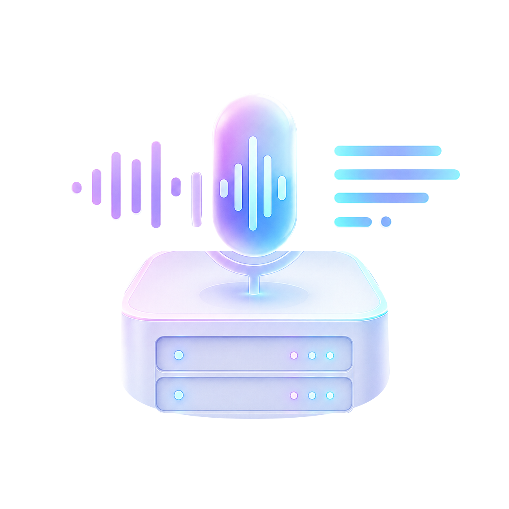
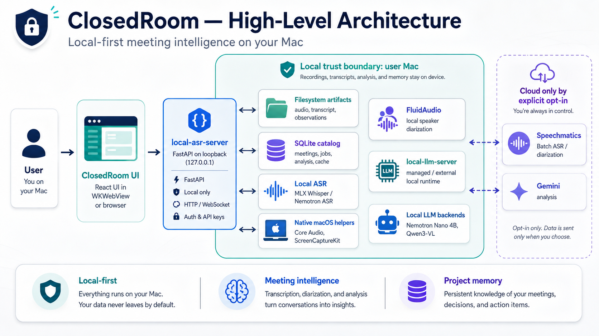
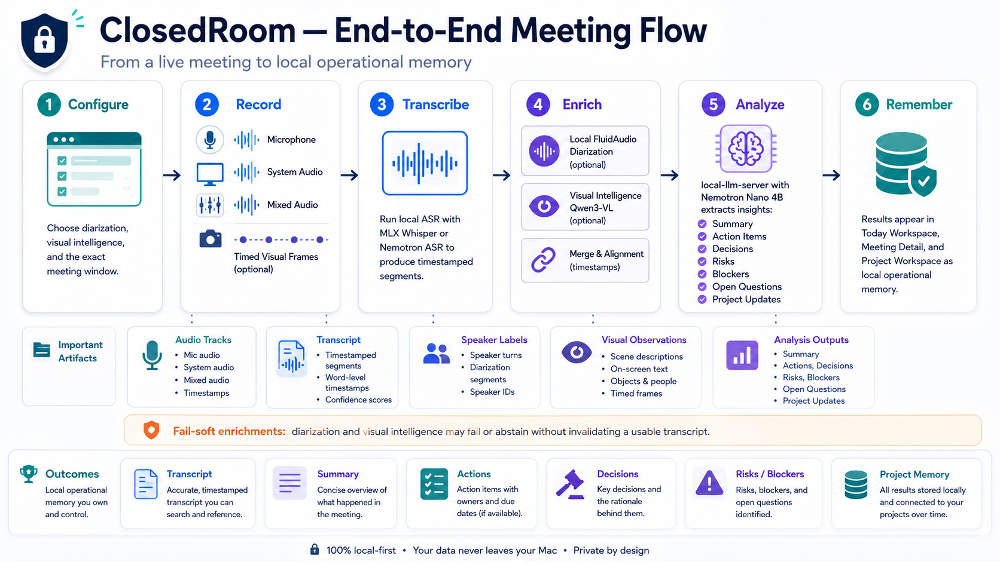
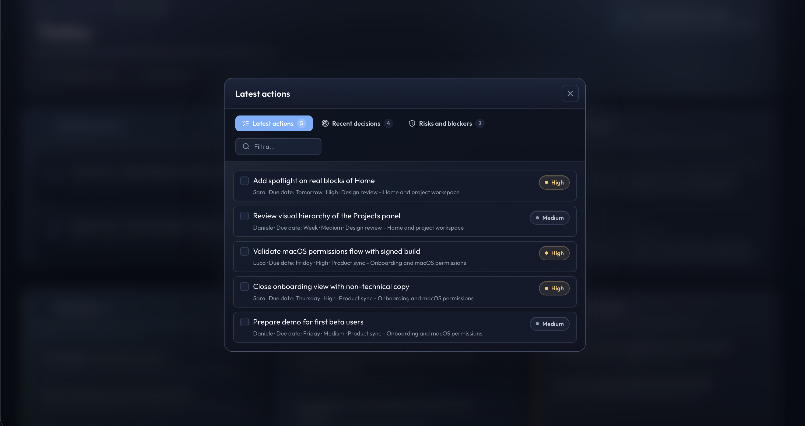
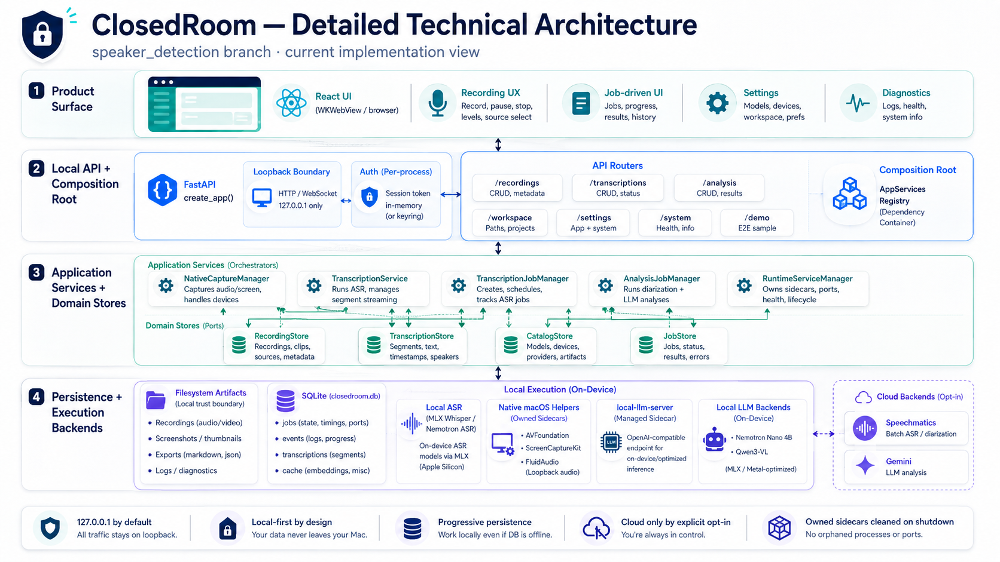

<p align="center">
  
</p>

<h1 align="center">ClosedRoom</h1>

<p align="center">
  <strong>Local-first Meeting Intelligence for macOS</strong><br>
  Record, transcribe, identify speakers, analyze, and remember meetings without making cloud APIs the default home for sensitive meeting data.<br>
  <code>local-asr-server</code> is the local backend and runtime behind the ClosedRoom workspace.
</p>

<p align="center">
  <a href="https://daniele21.github.io/">Mission</a> ·
  <a href="#local-meeting-intelligence-vision">Vision</a> ·
  <a href="#values-and-opportunities">Opportunities</a> ·
  <a href="#where-we-are-today">Today</a> ·
  <a href="#how-it-works">Architecture</a> ·
  <a href="#run-it">Run it</a> ·
  <a href="docs/features.md">Features</a>
</p>

<p align="center">
  
  
  
  <a href="LICENSE"></a>
</p>

## Why this exists

My mission is to [scale AI, GenAI, and Data Science with impact](https://daniele21.github.io/): move beyond isolated demos and turn AI into understandable, measurable, reusable products.

Meetings are a good example of where that gap still exists. They contain decisions, commitments, risks, blockers, project changes, and context that often disappears into raw transcripts, fragmented notes, chat messages, or memory.

ClosedRoom is designed to turn that information into a **local operational memory**.

The goal is intentionally bigger than speech-to-text:

- capture meetings locally and preserve recoverable audio artifacts;
- transcribe speech on-device with MLX/Nemotron ASR;
- separate speakers and, when evidence is strong enough, attach human-readable names conservatively;
- transform transcripts into summaries, actions, decisions, risks, open questions, minutes, and project updates;
- reuse extracted knowledge across meetings instead of treating every transcript as an isolated document;
- keep the default workflow local, while making any cloud processing explicit and optional.

ClosedRoom is therefore not just an ASR server. It is an experiment in making **meeting intelligence a private, local-first product capability**.

## Values and opportunities

ClosedRoom is designed around values that make meeting intelligence useful beyond a transcription demo.

| Value | What it means | Opportunity it creates |
| --- | --- | --- |
| **Local-first control** | Audio, transcripts, prompts, analysis results, diarization artifacts, and visual observations stay on the Mac by default | Sensitive meetings can be processed without making a remote AI API the default data boundary |
| **Intelligence over transcription** | The product extracts actions, decisions, risks, minutes, open questions, and project updates | Users can act on meetings without rereading raw transcripts |
| **Project memory over isolated meetings** | Meeting outputs can be reused across a project workspace | ClosedRoom can show what changed across multiple conversations instead of only what happened once |
| **Human-reviewable speaker attribution** | Diarization clusters remain the stable identity; visual evidence may name them only when support is strong enough | More useful transcripts without pretending uncertain identity inference is fact |
| **Fail-soft enrichment** | Diarization, visual intelligence, and audio intelligence may degrade without invalidating a usable transcript | Optional intelligence can improve the experience without making the core recording/transcription path brittle |
| **Replaceable provider boundaries** | Local and cloud ASR/LLM choices sit behind explicit configuration and runtime boundaries | Models and providers can evolve without rewriting the product workflow |

This creates several useful product directions:

- **For individual knowledge workers:** preserve decisions, actions, and context without manually maintaining meeting notes.
- **For project work:** connect multiple meetings into a living view of status, commitments, risks, and changes.
- **For sensitive contexts:** keep the default recording, transcription, diarization, and analysis path on the local machine.
- **For local-model experimentation:** compare ASR, diarization, visual, and LLM workflows inside a real product rather than a benchmark-only harness.
- **For hybrid deployments:** opt into Speechmatics or Gemini only when the user explicitly chooses a cloud capability.

## Local meeting intelligence vision

The product vision is a **private meeting workspace that remembers work, not just words**.

ClosedRoom should let a user move from a live meeting to an operationally useful memory without assembling separate recording, ASR, diarization, note-taking, LLM, and project-tracking tools.

In the default architecture:

- the React workspace talks to one local `local-asr-server` boundary;
- recording artifacts, transcript state, jobs, analysis runs, and project memory are persisted locally;
- MLX/Nemotron handles local ASR;
- FluidAudio can provide local post-meeting speaker diarization on supported Macs;
- `local-llm-server` provides the local reasoning and visual-model boundary;
- Qwen3-VL contributes conservative visual evidence for naming existing speaker clusters;
- Speechmatics and Gemini remain explicit opt-in cloud alternatives.



_The default trust boundary stays on the user's Mac; cloud providers sit outside it and are used only when explicitly selected._

## Strategy: from transcript to operational memory

The product sequence is deliberately simple from the user's point of view:



**Configure → Record → Transcribe → Enrich → Analyze → Remember**

Each step has a distinct responsibility:

1. **Configure the evidence path:** choose diarization, visual intelligence, provider options, and—when visual capture is enabled—the exact macOS window to observe.
2. **Preserve the meeting first:** record microphone/system audio progressively and finalize recoverable local artifacts before expensive inference begins.
3. **Create the transcript:** run local ASR or an explicitly selected provider and persist timestamped transcript output.
4. **Enrich without breaking the core:** add speaker diarization, visual evidence, and audio intelligence as fail-soft stages.
5. **Convert text into work:** run structured analysis for summaries, actions, decisions, risks, minutes, questions, and project updates.
6. **Reuse the result:** surface knowledge in Today, Meeting, and Project workspaces so context survives beyond one call.

## Where we are today

**ClosedRoom is already a working local-first macOS meeting intelligence application and local server.** The current `speaker_detection` branch extends the product with post-meeting speaker diarization, conservative visual speaker attribution, richer diagnostics, and a more explicit enrichment pipeline.

The current product can:

- record microphone and system audio, with native macOS capture where supported and a browser/BlackHole fallback;
- save meetings first and run transcription asynchronously afterward;
- transcribe locally with MLX Whisper or Nemotron ASR, with result caching for identical audio/options;
- diarize speakers locally with FluidAudio or opt into Speechmatics diarization;
- stage timestamped frames from an explicitly selected macOS window and analyze them with Qwen3-VL when visual intelligence is enabled;
- keep diarization clusters stable and use visual evidence only for conservative name attribution;
- run structured local meeting analysis through `local-llm-server` and Nemotron Nano 4B;
- browse Today, Meeting, and Project workspaces with persistent jobs, diagnostics, and analysis history;
- recalculate speakers without rerunning ASR;
- package the backend and product surface into a native macOS application.

> **Current boundary:** ClosedRoom is local-first by default, not local-only. Speechmatics and Gemini are available as explicit opt-in providers. Visual intelligence is disabled by default, and automatic speaker naming is intentionally conservative rather than guaranteed.

The current product surfaces make that milestone visible:

<table>
  <tr>
    <th>Today</th>
    <th>Recording</th>
    <th>Meeting</th>
  </tr>
  <tr>
    <td align="center"><a href="docs/assets/0.home.png"></a></td>
    <td align="center"><a href="docs/assets/1.recording.png"></a></td>
    <td align="center"><a href="docs/assets/5.meeting-analysis.png"></a></td>
  </tr>
  <tr>
    <td align="center">Meetings, actions, decisions, risks, and period context</td>
    <td align="center">Capture setup, diarization, and visual-intelligence controls</td>
    <td align="center">Transcript, audio, speaker context, and structured analysis</td>
  </tr>
</table>

<table>
  <tr>
    <th>Project memory</th>
    <th>Deep-dive actions</th>
  </tr>
  <tr>
    <td align="center"><a href="docs/assets/6.project-analysis.png"></a></td>
    <td align="center"><a href="docs/assets/4.deep-dive-actions.png"></a></td>
  </tr>
  <tr>
    <td align="center">Cross-meeting status, decisions, risks, and updates</td>
    <td align="center">Operational detail extracted from meeting intelligence</td>
  </tr>
</table>

## How it works



The current implementation separates product experience, orchestration, persistence, and execution backends:

- **Product surface:** React/TypeScript is served locally and runs either in a browser or the native WKWebView shell.
- **Local API boundary:** FastAPI binds to loopback by default, bootstraps a local authenticated session, and exposes recording, transcription, analysis, workspace, settings, runtime, and diagnostic APIs.
- **Composition root:** `create_app()` assembles long-lived services through `AppServices` rather than scattering process-global ownership across routes.
- **Recording:** ClosedRoom persists microphone, system, and mixed tracks plus metadata and optional visual frames; recordings are finalized before transcription begins.
- **Transcription:** MLX Whisper and Nemotron ASR provide the local path; transcription jobs persist progress, events, outputs, and cache identity.
- **Speaker diarization:** FluidAudio Community-1 can create local timestamped speaker clusters after a meeting. Speechmatics can be selected independently as a cloud diarization provider.
- **Visual intelligence:** Qwen3-VL consumes selected meeting-window frames after the meeting and contributes evidence for existing diarization clusters. It does not replace diarization and is not used as face recognition.
- **Meeting analysis:** `local-llm-server` isolates local model lifecycle and inference; Nemotron Nano 4B is used for structured meeting intelligence. Gemini remains an optional cloud analysis provider.
- **Persistence:** filesystem artifacts and the SQLite catalog store recordings, transcripts, jobs, events, analysis runs, diagnostics, and project-level state locally.
- **Failure handling:** enrichment stages record effective backend, warnings, and failure causes instead of turning every partial degradation into a failed transcript.

Speaker identity stays explicit end to end: **audio diarization determines who spoke when; visual intelligence may add a name only when the evidence satisfies the configured support and margin rules.** Users can rename clusters later without rerunning ASR.

For the durable system design and extension rules, read [`docs/architecture.md`](docs/architecture.md). The combined visual-intelligence and diarization path is tracked in [`docs/visual-diarization-e2e-readiness.md`](docs/visual-diarization-e2e-readiness.md).

### Why `local-llm-server` is a separate boundary

ClosedRoom delegates local LLM serving to [`local-llm-server`](https://github.com/daniele21/local-llm-server) instead of owning model-runtime details inside the meeting product.

That boundary handles model loading, backend selection, OpenAI-compatible inference, runtime lifecycle, model configuration, reasoning/JSON modes, vision inference, logs, and diagnostics. ClosedRoom stays focused on meeting workflows, evidence, persistence, and product state.

## Repository map

| Area | Main paths | Responsibility |
| --- | --- | --- |
| Product UI | `frontend/src/`, generated `src/local_asr_server/static/` | Today, recording, meeting, project, settings, guided workflows, and API client |
| API and composition | `src/local_asr_server/server.py`, `app_services.py` | FastAPI composition root, route wiring, local session boundary, long-lived services |
| Recording and macOS capture | `recordings.py`, `native_capture_helper/`, `macos_audio_helper/`, `audio_router.py` | Progressive recording, native microphone/system capture, fallback audio routing, recovery |
| Transcription and diarization | `transcriptions.py`, `asr_provider.py`, `speaker_diarization_helper/` | ASR provider boundary, transcript persistence, local FluidAudio speaker clustering |
| Meeting intelligence | `analysis_jobs.py`, `analysis_templates.py`, `audio_intelligence/` | Persistent analysis jobs, structured pipelines, optional enrichment |
| Local model runtime | `local-llm-server` dependency + runtime service manager | Local text/vision inference, model lifecycle, diagnostics |
| Persistence and configuration | `catalog.py`, `settings.py`, `paths.py` | SQLite catalog, settings, runtime paths, cross-feature metadata |
| macOS application | `menubar.py`, `window.py`, `ClosedRoom.spec`, `build.sh`, `build_assets/` | Native menu bar/WKWebView shell, PyInstaller bundle, signing and packaging |
| Validation and documentation | `test/`, `scripts/`, `docs/`, `AGENTS.md` | Unit/API tests, smoke harnesses, architecture, feature registry, engineering guidance |

[`AGENTS.md`](AGENTS.md) is the repository navigation and change guide; [`docs/features.md`](docs/features.md) is the business/technical feature registry.

## Run it

### Prerequisites

- macOS; Apple Silicon is recommended and required for some MLX/FluidAudio paths
- Python `>= 3.10`
- `ffmpeg`
- a local ASR model such as `mlx-community/whisper-large-v3-turbo` or `mlx-community/nemotron-3.5-asr-streaming-0.6b`
- [`local-llm-server`](https://github.com/daniele21/local-llm-server) and a compatible local analysis model for local meeting intelligence
- optional `blackhole-2ch` for the browser/system-audio fallback
- optional Speechmatics or Gemini credentials only when those cloud providers are explicitly selected

### Install and launch

```bash
git clone -b speaker_detection https://github.com/daniele21/local-asr-server.git
cd local-asr-server
./setup.sh
./run.sh
```

Or start the local API directly:

```bash
local-asr serve \
  --model mlx-community/nemotron-3.5-asr-streaming-0.6b \
  --recordings-dir ~/Recordings/local-asr \
  --port 1236
```

Open:

```text
http://127.0.0.1:1236
```

Development mode:

```bash
UV_CACHE_DIR=.cache/uv uv run local-asr serve --reload
```

### Build the macOS application

```bash
./build.sh --no-dmg
```

The packaged application includes the native capture helper and FluidAudio diarization helper. Build/package changes require macOS Apple Silicon and the relevant native toolchain.

## Use the local API

ClosedRoom exposes a local HTTP API because the browser UI, WKWebView shell, CLI workflows, and diagnostics all use the same product boundary.

Bootstrap a local session and check health:

```bash
curl -c /tmp/closedroom.cookies http://127.0.0.1:1236/v1/session
curl http://127.0.0.1:1236/health
```

For direct endpoint coverage, runtime status, transcription jobs, speaker re-diarization, visual intelligence, analysis pipelines, and diagnostics, use the API examples in [`docs/features.md`](docs/features.md) and the architecture references in [`docs/architecture.md`](docs/architecture.md).

## Evidence and maturity

ClosedRoom is an active local-first product and engineering project, not a guarantee of perfect transcription, speaker identity, or meeting understanding.

Current maturity boundaries include:

- MLX-based local inference is primarily designed for Apple Silicon;
- local FluidAudio diarization requires macOS 14+ and may be slower than speed-oriented defaults because the current profile favors short-turn recall;
- visual intelligence is disabled by default and requires an explicitly selected macOS window;
- speaker naming is evidence-based and conservative: uncertain mappings abstain rather than being promoted as known identities;
- Qwen visual processing can degrade independently while leaving the transcript usable;
- Speechmatics and Gemini move selected meeting data outside the machine and may incur provider cost;
- the macOS bundle pins runtime versions that have been verified together rather than always choosing the newest MLX stack automatically.

Use these sources for the current technical truth:

- [Architecture](docs/architecture.md)
- [Feature registry](docs/features.md)
- [Visual + diarization E2E readiness](docs/visual-diarization-e2e-readiness.md)
- [Task-aware visual intelligence plan](docs/task-aware-visual-intelligence-plan.md)
- [Audio intelligence / VAD plan](docs/audio-intelligence-vad-plan.md)
- [Repository engineering guide](AGENTS.md)

## Build and validate

Run the narrowest tests for the area you change. The repository uses Python `unittest`, focused API tests, frontend builds, and dedicated E2E/smoke harnesses for native and multimodal paths.

```bash
UV_CACHE_DIR=.cache/uv uv run python -m unittest discover -s test -v
```

Useful focused checks include:

```bash
UV_CACHE_DIR=.cache/uv uv run python -m unittest discover -s test -p 'test_recordings.py' -v
UV_CACHE_DIR=.cache/uv uv run python -m unittest discover -s test -p 'test_recording_api.py' -v
UV_CACHE_DIR=.cache/uv uv run python -m unittest discover -s test -p 'test_audio_router.py' -v
```

For the combined local visual + diarization path:

```bash
.venv/bin/python scripts/smoke_visual_diarization_e2e.py \
  --audio /path/to/two-speakers.wav \
  --frame /path/to/active-speaker.jpg \
  --base-url http://127.0.0.1:1245 \
  --output-dir /private/tmp/closedroom-combo-e2e
```

Coding agents should start from [`AGENTS.md`](AGENTS.md), which maps changes to the owning layer and documents repository-specific validation rules.

## License and author

ClosedRoom is available under the [MIT License](LICENSE).

Built by [Daniele Moltisanti](https://daniele21.github.io/) as part of a broader mission to make AI products useful, understandable, and deliberate about their technical and privacy trade-offs.