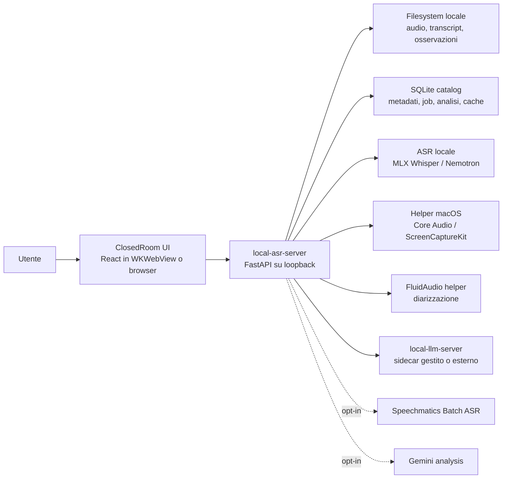
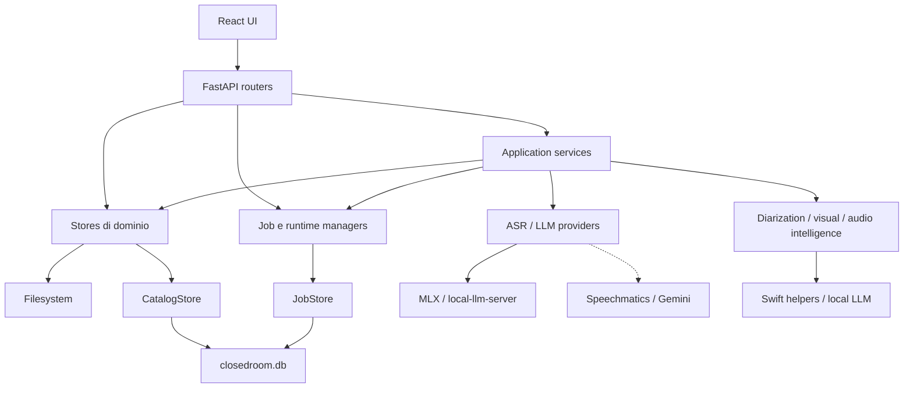
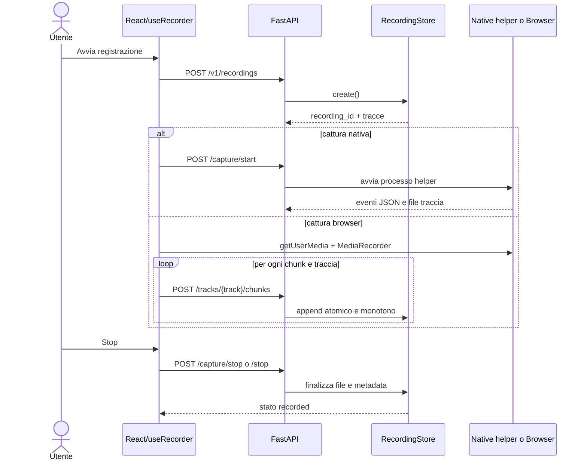
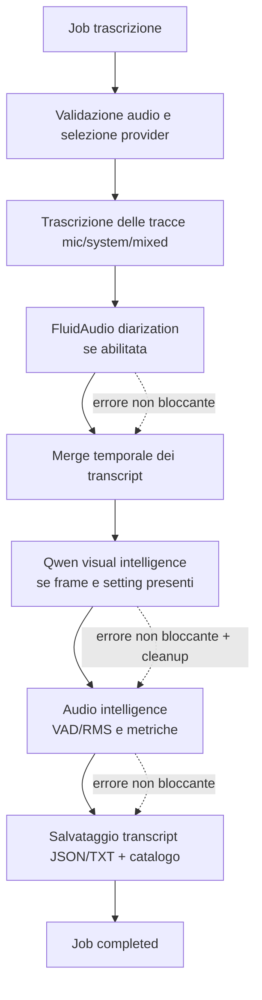
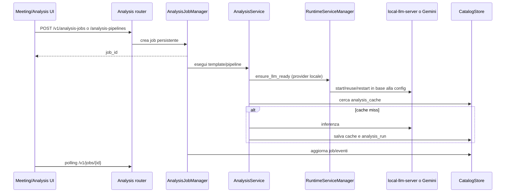
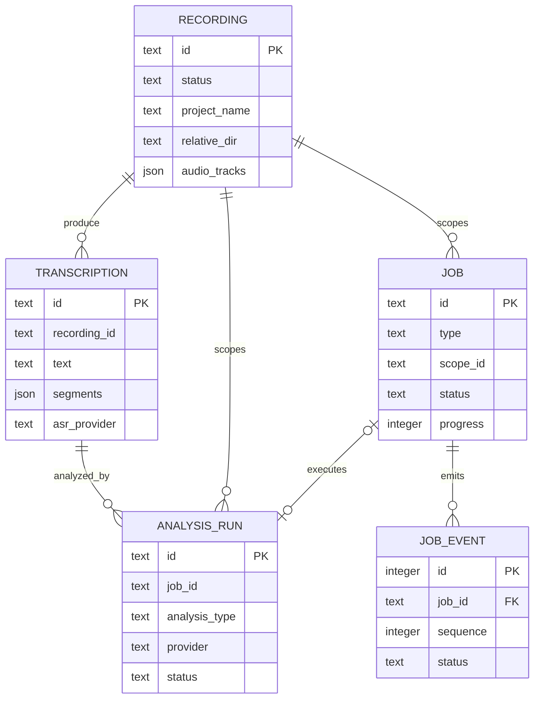

# Architettura di ClosedRoom

Stato del documento: architettura implementata nel repository al 13 luglio 2026.

Questo documento descrive ClosedRoom prima ad alto livello, per chiarire confini,
responsabilità e flussi principali, e poi a basso livello, per rendere espliciti
moduli, contratti, persistenza, concorrenza, packaging e punti di estensione.

## 1. Scopo e principi architetturali

ClosedRoom è un'applicazione macOS local-first per registrare meeting, trascrivere
audio, arricchire il transcript e produrre analisi operative. Lo stesso backend
può essere eseguito da CLI, dentro una app menu bar nativa o nel bundle PyInstaller.

I principi che guidano l'architettura sono:

- dati e inferenza locali per impostazione predefinita;
- registrazione separata da trascrizione e analisi;
- persistenza progressiva per limitare la perdita di dati;
- filesystem come fonte degli artefatti e SQLite come indice interrogabile;
- servizi ML pesanti avviati solo quando necessari;
- integrazioni cloud esclusivamente opt-in;
- compatibilità esplicita tra sviluppo e bundle macOS;
- fallimento controllato degli arricchimenti post-meeting: diarizzazione,
  visual intelligence e audio intelligence non devono invalidare il transcript;
- API HTTP come confine comune tra frontend, app nativa e backend.

## Parte I — Architettura ad alto livello

## 2. Contesto di sistema



Il trust boundary ordinario coincide con il Mac dell'utente. Il server ascolta
normalmente su `127.0.0.1`; Speechmatics e Gemini oltrepassano questo confine solo
quando selezionati esplicitamente.

## 3. Vista a container

| Container | Tecnologia | Responsabilità | Stato posseduto |
| --- | --- | --- | --- |
| Frontend | React, TypeScript, Vite | Navigazione, registrazione, configurazione, polling job e rendering workspace | Stato UI temporaneo; demo sintetica in memoria |
| API locale | FastAPI, Python | Composition root, autenticazione locale, contratti HTTP e orchestrazione applicativa | Registry dei servizi e token di sessione del processo |
| Servizi di dominio | Python | Registrazioni, trascrizioni, analisi, settings, runtime e arricchimenti | Lock e job attivi in memoria; stato durevole delegato agli store |
| Catalogo | SQLite WAL | Query su meeting, transcript, run di analisi, job, eventi e cache | `closedroom.db` |
| Archivio artefatti | Filesystem | Audio, metadata, transcript esportabili, report e staging visuale | Directory registrazioni e trascrizioni |
| Runtime ASR | MLX Whisper / `mlx-audio` | Trascrizione locale Apple Silicon | Cache modelli e cache risultati |
| Runtime LLM | `local-llm-server` | Inferenza testuale, audio o visuale locale | Processo, modello caricato e log |
| Helper nativi | Swift/Core Audio, AVFoundation, ScreenCaptureKit, FluidAudio | Routing/cattura audio, frame visuali e diarizzazione | Processi figli, eventi JSON e file di output |
| Shell macOS | rumps, Cocoa, WKWebView | Menu bar, lifecycle server e finestra nativa | Porta selezionata e lifecycle della app |

## 4. Componenti e dipendenze



Le dipendenze devono scendere dai router verso servizi e store. `server.py`
costruisce gli oggetti e non deve diventare un contenitore di logica di dominio.
`AppServices` è il registry tipizzato condiviso; gli alias su `app.state` sono una
compatibilità temporanea per test e integrazione nativa.

## 5. Flussi principali

### 5.1 Registrazione

ClosedRoom dispone di due backend di cattura:

1. nativo macOS, preferito, tramite AVFoundation e ScreenCaptureKit;
2. browser, con `MediaRecorder` e BlackHole per l'audio di sistema.



Il contratto critico è la sequenza monotona dei chunk. Un retry identico è
idempotente se dimensione e SHA-256 coincidono; un contenuto diverso per una
sequenza già committata genera conflitto. Ogni sessione usa un lock dedicato e
le scritture dei metadata sono atomiche.

### 5.2 Trascrizione e arricchimento post-meeting



Per ASR locale, l'inferenza usa MLX Whisper o Nemotron. Speechmatics Batch è
un provider opzionale e crea un job remoto per ogni traccia trascrivibile. Le
speaker label prodotte da un provider hanno precedenza sulla diarizzazione
locale.

### 5.3 Analisi



Le pipeline sono insiemi versionati di template. La cache include hash input,
prompt, provider, modello e opzioni capaci di modificare l'output. Le credenziali
cloud entrano nella chiave solo sotto forma di hash.

## 6. Modello dei dati ad alto livello



Una registrazione è l'aggregato che rappresenta il meeting. “Meeting” e
“Project” sono viste derivate dal catalogo, non tabelle parallele. Il filesystem
rimane necessario perché contiene audio e file esportabili; SQLite evita scansioni
ripetute e supporta query cross-feature.

## 7. Deployment e modalità di esecuzione

### Sviluppo CLI

`local-asr serve` avvia Uvicorn direttamente. La UI Vite compilata è servita da
`src/local_asr_server/static/`. Con reload viene usata una porta di sviluppo
separata.

### App menu bar

`local-asr app` o `menubar.py` avvia Uvicorn in un thread, sceglie una porta
locale utilizzabile e apre una `WKWebView`. Tutte le modifiche Cocoa/WebKit
rimangono sul main thread. In uscita vengono fermati i sidecar posseduti.

### Bundle macOS

PyInstaller usa `menubar.py` come entry point. `build.sh`:

1. compila il frontend React;
2. compila gli helper Swift e il package FluidAudio;
3. include `ffmpeg` e le relative librerie;
4. costruisce il bundle con `ClosedRoom.spec`;
5. include asset statici e import dinamici;
6. firma helper e bundle;
7. produce `.app` e, salvo `--no-dmg`, il DMG versionato.

I path runtime passano sempre da `paths.py`, che distingue sorgenti locali da
risorse in `sys._MEIPASS` e bundle `Contents`.

## Parte II — Architettura a basso livello

## 8. Composition root e lifecycle del backend

La funzione `create_app()` in `server.py` è la composition root:

1. configura FastAPI e CORS;
2. determina autenticazione e token di sessione;
3. sceglie il path del catalogo, con isolamento speciale per i test temporanei;
4. costruisce `CatalogStore` e `JobStore` sullo stesso database;
5. marca come `interrupted` i job non terminali lasciati da un riavvio;
6. costruisce recording/transcription store, manager di cattura, runtime e job;
7. registra tutto in `AppServices`;
8. pulisce dispositivi audio aggregati orfani;
9. monta asset statici e router;
10. installa il middleware di autenticazione.

`AppServices` contiene:

- `capture: NativeCaptureManager`;
- `runtime: RuntimeServiceManager`;
- `transcription: TranscriptionService`;
- `catalog: CatalogStore`;
- `jobs: JobStore`;
- `transcription_jobs: TranscriptionJobManager`;
- `analysis_jobs: AnalysisJobManager`;
- `recordings: RecordingStore`;
- `transcriptions: TranscriptionStore`.

Gli oggetti sono posseduti da una singola istanza FastAPI. Non va introdotto
nuovo stato globale quando può essere espresso come servizio nel registry.

## 9. Layer HTTP

I router sono sottili adattatori tra Pydantic/HTTP e il dominio:

| Router | Superficie |
| --- | --- |
| `routers/recordings.py` | Sessioni, chunk per traccia, frame visuali, stop/recovery, audio e metadata |
| `routers/transcriptions.py` | Upload/path, job di trascrizione, storico, merge/split e API job condivise |
| `routers/analysis.py` | Analisi sincrona legacy, job, pipeline, template e run persistiti |
| `routers/workspace.py` | Proiezioni `meetings` e `projects` |
| `routers/settings.py` | Lettura pubblica e patch validata delle impostazioni |
| `routers/system.py` | Health/session, routing audio, cattura nativa, modelli, prompt, runtime, dialog e overlay |
| `routers/demo.py` | Popolamento e rimozione dei dati mock locali |

### Autenticazione locale

Il server genera un token casuale a ogni processo, salvo
`LOCAL_ASR_API_TOKEN`. `/v1/session` lo consegna come cookie same-origin;
le richieste API successive usano cookie o bearer token. Health, index e asset
statici sono pubblici. L'autenticazione è disabilitabile solo esplicitamente con
`LOCAL_ASR_REQUIRE_AUTH=0`.

CORS non è aperto implicitamente: le origin ammesse provengono da configurazione.

## 10. Dominio registrazioni

`RecordingStore` possiede:

- stati ammessi della registrazione;
- modalità `both`, `mic_only`, `pc_only`, `legacy_mixed`;
- tracce canoniche `mixed`, `mic`, `system`;
- sequenze chunk, hash, dimensioni e timestamp client;
- finalizzazione, recovery, discard e sincronizzazione catalogo;
- staging e cleanup dei frame visuali;
- report qualità, intelligence e diarizzazione.

### Layout di sessione

```text
<recordings_dir>/<YYYY-MM-DD>/<recording-id>/
├── metadata.json
├── timeline.json                      # eventi cattura, quando presenti
├── quality_report.json                # validazione file/tracce
├── recording.<ext>                    # traccia primaria/mista
├── mic.<ext>                          # se acquisita
├── system.<ext>                       # se acquisita
├── speaker-diarization.json           # risultato o errore FluidAudio
├── intelligence.json                  # metriche conversazionali
├── visual_observations.jsonl          # evidenze Qwen strutturate
├── visual_summary.json                # summary visual intelligence
└── .visual-staging/                    # JPEG persistenti della registrazione
```

Durante l'upload browser vengono usati file parziali. La finalizzazione rende
disponibile il file audio definitivo solo dopo il commit dei chunk. `metadata.json`
è la fonte di recupero della singola sessione; la riga SQLite è la sua proiezione
interrogabile.

### Stati

Gli stati validi sono `recording`, `finalizing`, `recorded`, `interrupted`,
`recoverable`, `transcribing`, `completed` e `failed`. Le transizioni devono
essere eseguite attraverso `RecordingStore`, mantenendo file e catalogo coerenti.

## 11. Cattura e routing audio macOS

### NativeCaptureManager

`NativeCaptureManager` avvia l'helper ScreenCaptureKit/AVFoundation come processo
figlio e interpreta eventi JSON line-oriented. Mantiene sessioni attive, queue
eventi, warning, livelli audio e riferimenti alle tracce. Alla chiusura valida i
file tramite `ffprobe`, registra report qualità e finalizza lo store.

L'helper nativo può acquisire:

- microfono con AVFoundation;
- audio di sistema con ScreenCaptureKit;
- frame JPEG a bassa frequenza da una sola finestra esplicitamente scelta.

La cattura visuale è uno stream separato da quella audio e non è attiva senza
setting e selezione finestra. La schermata Registrazione espone nello stesso
punto il toggle FluidAudio, il toggle Qwen e il selettore della finestra: una
configurazione parziale è dichiarata prima dell'avvio.

### AudioRouter

`AudioRouter` e l'helper Core Audio gestiscono il dispositivo temporaneo usato
dal fallback BlackHole. Il lifecycle comprende snapshot dell'output originale,
attivazione, verifica, ripristino e cleanup dopo crash. Lo stato di recovery è
salvato nella cache e gli aggregati orfani vengono rimossi all'avvio.

## 12. Trascrizione

`TranscriptionService` possiede la policy applicativa; `transcriber.py` e i
provider possiedono l'esecuzione ASR.

### Risoluzione provider

- `asr_provider.py` centralizza identificativi, default e metadata pubblici;
- provider `local`: modello MLX Whisper o Nemotron risolto da `asr_models.py`;
- provider `speechmatics`: adapter lazy in `speechmatics_asr.py`;
- chiavi e opzioni private non entrano nel transcript.

### Cache ASR

La chiave SHA-256 copre byte audio e opzioni effettive: provider, modello,
lingua, task, prompt, temperatura, word timestamps, condition-on-previous,
VAD e opzioni pubbliche provider. La cache vive in `.cache/` in sviluppo e in
`~/Library/Caches/ClosedRoom/` nel bundle.

### Merge multi-traccia

Ogni traccia è trascritta separatamente. I segmenti sono poi normalizzati e
ordinati temporalmente, conservando source track, label e speaker provider.
Tracce quasi silenziose vengono rilevate prima dell'ASR e saltate con metadata
espliciti.

### TranscriptionStore

Ogni transcript salvato produce:

```text
<transcriptions_dir>/
├── transcript_<timestamp>_<id>.json
└── transcript_<timestamp>_<id>.txt
```

Il JSON conserva testo, segmenti, statistiche, provider/backend, opzioni
pubbliche, tracce sorgente e analisi legacy. La stessa entità viene indicizzata
in SQLite. Merge e split non cancellano le fonti: aggiornano `hidden` e
`merged_into`, consentendo il ripristino.

## 13. Pipeline di arricchimento

### Diarizzazione locale

`LocalSpeakerDiarizationService` invoca l'eseguibile Swift FluidAudio Community-1.
I modelli Core ML risiedono in
`~/Library/Application Support/ClosedRoom/models/fluidaudio-speaker-diarization/`.
Il risultato viene associato ai segmenti ASR in base al massimo overlap, se
supera `speaker_diarization_minimum_overlap`. Il valore assegnato ha forma
`<track>:<cluster>` e non sovrascrive `provider_speaker` già presente.

### Visual intelligence

`PostMeetingVisualService`:

1. legge i frame ordinati dallo staging;
2. richiede a `RuntimeServiceManager` un modello con capability `image`;
3. invia ogni frame a Qwen con prompt JSON restrittivo;
4. accetta solo nomi e indicatori visibili, senza face recognition;
5. persiste osservazioni e summary;
6. applica un mapping conservativo solo a cluster speaker già esistenti;
7. conserva i JPEG come artefatti della registrazione per consultazione e retry.

Il sidecar LLM/VLM gestito parte con un solo modello residente. Per i modelli
di prodotto registrati (`nemotron-nano-4b`, `nemotron-nano-4b-q8`,
`qwen3-vl-4b`) `RuntimeServiceManager` usa il control plane pubblico di
local-llm-server 0.4 per attivare il modello richiesto dopo aver evacuato
quello della fase precedente. Al termine di visual intelligence o analisi
locale, tutti i runtime registrati vengono scaricati e il sidecar resta sano
in stato zero-resident. Endpoint `external` non vengono mai mutati. Modelli
con path configurato esplicitamente, custom o non registrati mantengono il
boundary più conservativo stop/restart del processo posseduto, così
l'artefatto esplicito non viene perso. Un failure
del control plane durante il cleanup degrada a stop del sidecar posseduto,
evitando residency orfana e senza mascherare il risultato del workload.

Dopo tre errori infrastrutturali consecutivi dal backend visuale, un circuit
breaker interrompe le richieste residue, marca il checkpoint come
`retryable_failure` e conserva lo staging. Il successivo avvio non riusa dalla
cache l'arricchimento fallito e può ritentare gli stessi frame. Il cleanup
centralizzato elimina dopo 24 ore soltanto checkpoint e staging della
generazione incompleta, senza cancellare i JPEG catturati. Gli
errori di validazione di singole risposte restano invece degradazioni locali e
non aprono il circuit breaker.

Nel percorso task-aware `v2`, `shared_content.py` possiede la normalizzazione
dei tipi e la policy di cadenza. Il router assegna alla ROI fonte, confidence e
fallback esplicito; il servizio classifica la prima osservazione e filtra solo
gli heartbeat troppo ravvicinati, lasciando sempre passare i cambi ROI. La ROI
generica resta sperimentale finché non viene validata su Meet, Zoom e Teams.
`inference.py` valida inoltre ogni risposta con un contratto specifico del task:
valori parziali o con tipi errati restano errori diagnostici del candidato e non
raggiungono aggregazione temporale o fusion.

`visual_intelligence.json` è il documento canonico v2. `fusion.py` aggiunge
`semantic_links` derivati esclusivamente dalla sovrapposizione temporale fra
eventi/keyframe e segmenti del transcript: ogni link conserva gli identificativi
delle evidenze e non modifica le sorgenti. L'endpoint `/v1/.../visual-intelligence`
mantiene il wrapper legacy; `/v2/.../visual-intelligence` restituisce il contratto
canonico tipizzato.
Ogni esito terminale sostituisce il set di artefatti della generazione: un rerun
v1 rimuove documento e routing v2 obsoleti, mentre una feature disabilitata
preserva intenzionalmente l'ultima generazione completata.

Durante il processing v2, `visual_processing_checkpoint.json` conserva soltanto
il fingerprint della configurazione/candidati, la versione prompt e il tempo di
aggiornamento. Le osservazioni indipendenti già
scritte in JSONL vengono riusate dopo un arresto di processo con fingerprint
identico; a completamento viene eliminato il checkpoint, mentre i JPEG restano
associati alla registrazione. I
`semantic_links` persistono solo ID e intervalli dei segmenti, non una seconda
copia del testo o delle label speaker.
Checkpoint e staging di generazione recuperabili hanno retention centralizzata
di 24 ore e sono ripuliti da `RecordingStore` all'avvio; i frame catturati non
scadono. Gli artefatti terminali vengono
prima scritti in `.visual-generation-staging/<generation_id>` e poi promossi;
summary, documento, routing e metadata condividono lo stesso `generation_id`.
Metadata e catalogo sono aggiornati per ultimi, e le API rifiutano generazioni
parziali invece di combinare file appartenenti a run diversi.
Le share session sono delimitate dalle transizioni osservabili start/stop; senza
meeting state si usa un fallback basato sui keyframe, mentre i keyframe esterni
a finestre note sono esposti in `unassigned_share_keyframes`.

La UI React carica il documento v2 da `MeetingDetailPage` e delega il rendering
a `components/meeting/VisualIntelligencePanel.tsx`. Il pannello gestisce timeline,
share session, mapping accettati/da verificare, astensione, loading, errore e
dataset vuoto; le soglie di tuning restano nel backend.

Il contratto JSON è imposto dal prompt e validato localmente. Per compatibilità
con l'output osservato di Qwen MLX, il parser accetta JSON, code fence, literal
dictionary sicuri e un singolo wrapper `{` duplicato; struttura e tipi restano
comunque soggetti allo stesso schema applicativo. Non viene inviato
`response_format=json_object`, perché il backend MLX-VLM può rispondere con un
oggetto vuoto quando riceve quell'opzione.

La fusione richiede il numero minimo di osservazioni e il margine configurati.
In caso di evidenza insufficiente si astiene.
Se la visual intelligence è richiesta ma non esiste alcun frame, l'esito è
`degraded` con causa `no_visual_frames_captured`, non un successo implicito.

### Audio intelligence

`audio_intelligence/` calcola finestre vocali, pause, overlap, speaking time,
speech rate ed energia. Preferisce Silero VAD e degrada a RMS se il backend VAD
non è disponibile. Gli insight attuali sono candidati mock esplicitamente
marcati; non viene invocato un LLM.

## 14. Job, eventi e concorrenza

Trascrizioni e analisi lunghe vengono eseguite in thread daemon del processo.
Non esiste una coda distribuita esterna.

`JobStore` persiste:

- stato corrente e progress in `jobs`;
- timeline append-only in `job_events`;
- payload e risultato JSON;
- richiesta di cancellazione;
- timestamp di avvio e completamento.

Il transcription job pubblica esplicitamente anche `diarizing`,
`visual_processing` e `audio_intelligence`, così polling, eventi persistiti e UI
non restano fermi durante gli arricchimenti locali più lunghi.

Stati terminali: `completed`, `failed`, `cancelled`, `interrupted`. La
cancellazione è cooperativa: passa prima a `cancelling`; il worker dichiara
`cancelled` solo dopo avere osservato la richiesta ed essere uscito. Al riavvio
del server, i job non terminali diventano `interrupted`, perché i thread non
possono sopravvivere al processo.

Questa scelta è adeguata a una singola app desktop locale. Un futuro execution
backend multi-processo richiederebbe lease, heartbeat, coda durevole e worker
idempotenti.

## 15. Analisi e runtime LLM

### Provider

`llm.py` espone una facciata comune per:

- `mock`, usato in test/demo;
- `gemini`, cloud opt-in;
- `nemotron_local`, testo locale;
- `voxtral_local`, audio locale diretto.

`AnalysisService` risolve testo o audio di input, applica override per-run,
costruisce la cache key, invoca il provider e normalizza il risultato in una
struttura che include Markdown.

### Sidecar locale

`RuntimeServiceManager` supporta tre modalità:

- `auto`: possiede il processo `local-llm-server`;
- `external`: usa un endpoint configurato e ne interroga `/health`;
- `disabled`: rifiuta l'analisi locale.

`LocalLLMSidecar` sceglie una porta libera su loopback, avvia il modulo o
l'eseguibile, attende readiness, raccoglie log e riavvia il processo quando
cambia la configurazione effettiva: modello, path, backend, mmproj, context size,
timeout o binary llama-server. La capability audio disabilita il reasoning in
modalità automatica; testo e immagine usano le policy risolte dal runtime.

Nel bundle, l'eseguibile principale gestisce anche i dispatch interni
`-m local_llm_server` e `-m mlx_vlm.server`, evitando di riaprire la shell UI nei
processi sidecar. La build macOS usa Python 3.10 e fissa `mlx 0.31.2`: `mlx 0.32.0`
ha mostrato una regressione di ownership degli stream GPU nel worker PyInstaller.

## 16. Persistenza dettagliata

| Dato | Posizione | Owner | Garanzia |
| --- | --- | --- | --- |
| Settings | `~/Library/Application Support/ClosedRoom/settings.json` | `settings.py`, `SettingsService` | Scrittura atomica e validazione prima del commit |
| Catalogo | `~/Library/Application Support/ClosedRoom/closedroom.db` | `CatalogStore`, `JobStore` | SQLite WAL, transazioni e indici |
| Registrazioni | setting `recordings_dir` | `RecordingStore` | Lock per sessione, chunk monotoni, metadata atomici |
| Transcript | setting `transcriptions_dir` | `TranscriptionStore` | JSON/TXT più indice SQLite |
| Cache ASR | cache app/dev | transcription layer | Chiave SHA-256 sugli input effettivi |
| Cache analisi | tabella `analysis_cache` | `AnalysisService` | Chiave SHA-256 versionata |
| Prompt | `prompts.json` in Application Support | system router/catalog helpers | Persistenza locale |
| Log LLM | `~/Library/Logs/ClosedRoom/llm-server.log` | `LocalLLMSidecar` | Append del processo sidecar |
| Log applicativo | `~/Library/Logs/ClosedRoom/closedroom.log` | `app_logging.py`, `diagnostics.py` | Rotazione 5 MiB × 3, record correlati e redazione secret |
| Modelli | `~/Library/Application Support/ClosedRoom/models/` | runtime ASR/FluidAudio | Riutilizzati tra aggiornamenti app |
| Routing recovery | cache app/dev | `AudioRouter` | Ripristino post-crash |

### Tabelle SQLite

- `recordings`: proiezione interrogabile dei metadata e delle tracce;
- `transcriptions`: testo, segmenti, provider, merge e riferimenti file;
- `analysis_runs`: esecuzioni tipizzate, template, pipeline, output e stato;
- `analysis_cache`: risultati riutilizzabili per chiave;
- `jobs`: stato durevole dei task lunghi;
- `job_events`: sequenza degli aggiornamenti di ciascun job.

Le modifiche additive allo schema usano `_ensure_column`; non esiste al momento
un framework di migrazioni versionate separato.

## 17. Settings e precedenza della configurazione

`DEFAULT_SETTINGS` in `settings.py` è la fonte dei default persistenti. La
configurazione effettiva deriva da:

1. default di codice;
2. `settings.json`;
3. variabili ambiente per secret e configurazione di processo;
4. override espliciti nel payload di una singola analisi.

I secret salvati (`gemini_api_key`, `speechmatics_api_key`) non vengono restituiti
dall'API; il frontend riceve solo flag `*_configured`. Cataloghi di modelli,
provider e preset devono restare centralizzati nei rispettivi moduli backend e
in `frontend/src/api/config.ts` per la presentazione.

## 18. Frontend

### Struttura

`frontend/src/App.tsx` possiede navigazione hash-based, bootstrap sessione,
health, lingua, demo e tour. Le pagine principali sono:

- `DashboardPage`: vista Oggi e digest;
- `RecordingPage` e `RecordingOverlayPage`: cattura e controllo;
- `TranscriptionPage`: sorgenti, job, risultati, merge e split;
- `MeetingDetailPage`: workspace del singolo meeting;
- `ProjectsPage`: proiezione per progetto;
- `AnalysisPage`: analisi libera o su transcript;
- `SettingsPage`: configurazione e runtime locale.

`frontend/src/api/apiClient.ts` è il contratto HTTP tipizzato. Le pagine non
devono duplicare URL o serializzazione. `useRecorder` orchestra il complesso
lifecycle di cattura; `useAudioDevices` possiede dispositivi, permission e
routing. I testi vivono in `i18n/locales/it.ts` e `en.ts`.

### Distribuzione

Vite scrive la build in `src/local_asr_server/static/`; FastAPI la serve sia in
sviluppo sia nel bundle. Gli asset hashed sono generati e non vanno modificati a
mano. `static_vanilla_backup/` è una copia legacy, non la superficie runtime.

## 19. Error handling e recovery

- una sessione lasciata in registrazione viene marcata interrotta/recoverable;
- chunk duplicati sono accettati solo se identici;
- ogni stop o errore di cattura deve ripristinare il routing audio;
- file nativi vengono verificati con `ffprobe` prima di essere dichiarati validi;
- job attivi al restart diventano `interrupted`;
- cambio configurazione LLM provoca restart controllato del sidecar;
- diarizzazione, Qwen e audio intelligence salvano errore/stato ma non bloccano
  il transcript;
- i checkpoint visuali terminali vengono chiusi senza eliminare i frame;
- scritture settings e principali JSON di registrazione usano file temporaneo e
  `os.replace`.

## 20. Sicurezza e privacy

### Controlli implementati

- bind predefinito su loopback;
- token sessione locale e confronto constant-time;
- allowlist CORS configurabile;
- provider cloud disattivati per default;
- secret rimossi dalle risposte e dai metadata;
- hash delle credenziali, non credenziali, nelle cache key;
- selezione esplicita della finestra per acquisizione visuale;
- frame visuali persistenti nella directory privata della registrazione;
- bundle helper con usage description macOS e code signing.

### Assunzioni

ClosedRoom non è progettato come servizio multi-tenant esposto a Internet. Chi
ha accesso all'account macOS e alle directory dati può leggere audio, transcript,
database e log. Backup, cifratura disco, retention e cancellazione sicura restano
responsabilità dell'ambiente utente.

## 21. Osservabilità

L'osservabilità è locale e orientata al desktop:

- `/health` espone identità, versione, PID e stato bundle;
- API runtime espongono status, PID, porta, modello caricato ed errori sidecar;
- `job_events` conserva progress e transizioni;
- `timeline.json`, quality report e warning registrano il lifecycle cattura;
- log Uvicorn coprono backend e arricchimenti;
- il sidecar LLM ha un file log dedicato consultabile dalla Settings UI;
- `closedroom.log` raccoglie il log applicativo ruotato; il comando
  `local-asr inspect-meeting <recording-id>` riepiloga gli outcome persistiti.

Non sono presenti metriche remote, tracing distribuito o telemetry SaaS.

## 22. Regole per estendere l'architettura

### Nuovo endpoint

1. aggiungere/estendere uno schema in `schemas.py`;
2. collocare la route nel router di dominio;
3. mettere decisioni applicative in un service;
4. usare store/catalogo esistenti per la persistenza;
5. aggiornare `apiClient.ts` e i chiamanti;
6. aggiungere test TestClient e aggiornare documentazione.

### Nuovo provider ASR o LLM

1. aggiungere identificatore e metadata nel registry provider;
2. implementare l'adapter dietro l'interfaccia corrente;
3. separare opzioni private e pubbliche;
4. includere tutte le opzioni rilevanti nelle cache key;
5. mantenere import lazy per dipendenze opzionali;
6. aggiornare settings, frontend config, package extra e test.

### Nuovo arricchimento post-meeting

1. inserirlo nella pipeline dopo l'ASR nel punto semanticamente corretto;
2. renderlo idempotente e non bloccante salvo requisito contrario;
3. definire owner e formato persistito;
4. evitare di duplicare metadata nel filesystem e nel catalogo senza una
   strategia di sincronizzazione;
5. dichiarare cleanup, timeout e comportamento su cancel/restart.

### Nuovo helper nativo

1. mantenere import e compile lazy in sviluppo;
2. centralizzare il path in `paths.py`;
3. includere sorgenti come package data;
4. compilare, includere e firmare in `build.sh`/`ClosedRoom.spec`;
5. verificare TCC, main thread e architettura arm64;
6. eseguire `./build.sh --no-dmg`.

## 23. Vincoli e debito architetturale noto

- i job sono persistiti ma i worker sono thread in-processo: non riprendono dopo
  restart;
- lo schema SQLite evolve con colonne additive, senza migration ledger;
- `AppServices` mantiene alias legacy su `app.state` durante la migrazione;
- filesystem e catalogo richiedono sincronizzazione esplicita;
- alcuni store rileggono settings dinamicamente, quindi una directory globale
  può prevalere su un default iniettato;
- il frontend è una SPA hash-based senza router library dedicata;
- audio intelligence produce ancora insight mock;
- gli arricchimenti, ASR/VAD, cattura nativa e overlay espongono fallback
  espliciti, verificati anche dalla `.app`; l'eseguibile congelato inoltra
  `inspect-meeting` alla CLI senza avviare la shell grafica;
- la baseline test include casi storicamente non allineati per AudioRouter e
  directory recording, da distinguere dalle regressioni reali;
- build, cattura nativa e diarizzazione sono intenzionalmente Apple Silicon/macOS.

## 24. Mappa delle fonti di verità

| Concetto | Fonte di verità |
| --- | --- |
| Composition e dipendenze | `src/local_asr_server/server.py`, `app_services.py` |
| Contratti request/response | `schemas.py`, router, `frontend/src/api/apiClient.ts` |
| Stati e tracce recording | `recordings.py` |
| Provider ASR | `asr_provider.py`, `asr_models.py` |
| Workflow trascrizione | `services/transcription_service.py`, `transcription_jobs.py` |
| Template/pipeline analisi | `analysis_templates.py`, `analysis_jobs.py` |
| Provider LLM | `llm.py` |
| Lifecycle sidecar | `runtime/service_manager.py`, `runtime/llm_sidecar.py` |
| Persistenza interrogabile | `catalog.py`, `jobs/job_store.py` |
| Path dev/bundle | `paths.py` |
| Default settings | `settings.py` |
| Cattura macOS | `native_capture.py`, `native_capture_helper/` |
| Diarizzazione | `speaker_diarization.py`, `speaker_diarization_helper/` |
| Visual intelligence | `visual_intelligence/`: `service.py` orchestra; `contracts.py` possiede schemi/configurazione; `signatures.py` le firme economiche; `router.py` la selezione task-aware; `inference.py` i prompt per task; `temporal.py` intervalli/eventi/sessioni; `fusion.py` il mapping conservativo sui cluster provider. |
| Processor visuali | `visual_intelligence/processors.py` converte risposte legacy e task-aware in osservazioni persistibili; parsing e validazione restano in `inference.py`, mentre `service.py` coordina policy, routing e lifecycle. |
| Fetch visuale React | `api/visualIntelligence.ts` possiede i contratti e `hooks/useVisualIntelligence.ts` loading/error/abort; `MeetingDetailPage` coordina il workspace senza attendere il documento v2. |
| Frontend navigation | `frontend/src/App.tsx` |
| Build e packaging | `build.sh`, `ClosedRoom.spec`, `pyproject.toml` |
| Registro funzionale | `docs/features.md` |

## 25. Verifica dell'architettura

Lo stato operativo e i gate per rendere testabile end-to-end la combinazione
visual intelligence + diarizzazione sono tracciati in
[`visual-diarization-e2e-readiness.md`](visual-diarization-e2e-readiness.md).

Verifica rapida senza inferenza reale:

```bash
UV_CACHE_DIR=.cache/uv uv run python -m unittest discover -s test -v
cd frontend && pnpm run build
```

Per modifiche a helper, bundle, risorse o path PyInstaller:

```bash
./build.sh --no-dmg
```

Non usare una trascrizione Whisper reale come smoke test: può scaricare modelli
grandi. Preferire TestClient, provider mock e test mirati sui service boundary.
