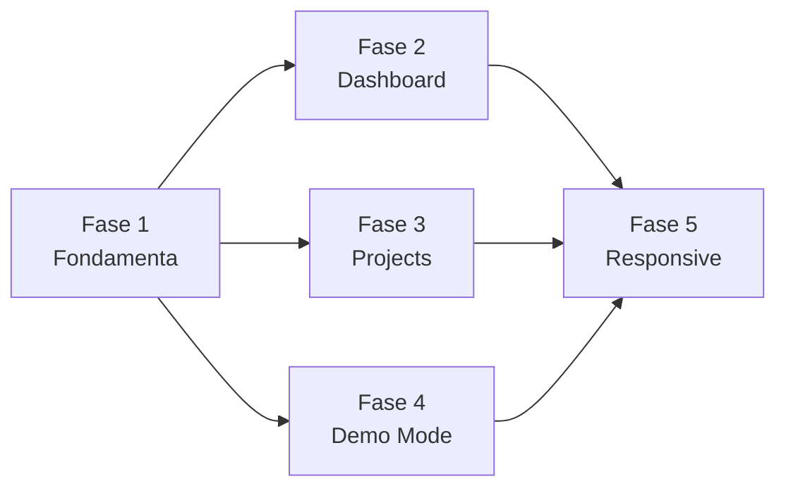

# Piano d'Azione — Redesign UX/UI ClosedRoom

> Riferimento: [Analisi UX/UI](file:///Users/moltisantid/.gemini/antigravity-ide/brain/1f21eec0-50c6-48af-a7ac-07e9a2ab9186/ux_ui_analysis.md)  
> Decisioni prese: Radix UI Primitives · Tutte e 5 le fasi · Layout change consentito  
> Stima totale: ~16-20h di lavoro

---

## Principi Guida

1. **Progressive Disclosure** — Mostra il minimo per orientare, dettaglio on-demand in dialog
2. **Mobile-first responsive** — Layout pensato da 375px, arricchito verso 1920px
3. **Radix UI Primitives** — Dialog e Sheet headless, zero styling imposto, a11y gratis
4. **Design system preservato** — Palette, font, animazioni, glassmorphism restano. Cambia la struttura
5. **Modularità** — File sotto 400 righe, componenti singola responsabilità

---

## Fase 1 — Fondamenta (Componenti Core)

> **Sbloccante per tutte le fasi successive**  
> Stima: ~3-4h

### 1.0 — Installare Radix UI

```bash
cd frontend && pnpm add @radix-ui/react-dialog
```

> [!NOTE]
> Serve solo `@radix-ui/react-dialog`. Il componente Sheet può essere costruito sullo stesso primitivo Dialog con styling diverso (slide-in laterale). Non servono altri pacchetti Radix.

---

### 1.1 — `[NEW]` Dialog.tsx

**File:** `frontend/src/components/ui/Dialog.tsx`

Wrapper styled sopra `@radix-ui/react-dialog` con:

| Feature | Dettaglio |
|---------|-----------|
| `<Dialog>` | Wrapper root, gestisce `open`/`onOpenChange` |
| `<DialogOverlay>` | `fixed inset-0 bg-black/60 backdrop-blur-md`, fade-in 200ms |
| `<DialogContent>` | Centrato, `max-w` configurabile (`sm`/`md`/`lg`/`xl`/`full`) |
| `<DialogHeader>` | Titolo + descrizione + close button |
| `<DialogBody>` | Area scrollabile `overflow-y-auto max-h-[70vh]` |
| `<DialogFooter>` | Azioni allineate a destra |
| **Responsive** | Su viewport ≤ 640px: diventa bottom sheet (`fixed bottom-0 inset-x-0 rounded-t-2xl`) |
| **Animazioni** | Desktop: `scale-95→100 + fade-in`. Mobile: `translate-y-full→0` (slide up) |
| **a11y** | Focus trap, ESC close, aria-labelledby — tutto da Radix gratis |

Styling: usa le CSS custom properties esistenti (`--bg-surface`, `--border-subtle`, `--shadow-premium`)

---

### 1.2 — `[NEW]` Sheet.tsx

**File:** `frontend/src/components/ui/Sheet.tsx`

Costruito sullo stesso `@radix-ui/react-dialog` ma con layout diverso:

| Feature | Dettaglio |
|---------|-----------|
| Posizione | Slide-in da destra, `fixed right-0 top-0 h-full w-[420px]` |
| Mobile | Full-width `w-full` |
| Animazione | `translate-x-full → translate-x-0` slide-in |
| Uso | Transcript completo, analysis detail, run history |

---

### 1.3 — `[NEW]` DemoBanner.tsx

**File:** `frontend/src/components/ui/DemoBanner.tsx`

Banner persistente che appare sotto la navbar quando demo mode è attivo:

```
┌────────────────────────────────────────────────────────────┐
│ 🎭  Stai esplorando con dati dimostrativi.                  │
│     Registra un meeting reale per iniziare.                 │
│                                    [Esci demo] [Tour →]    │
└────────────────────────────────────────────────────────────┘
```

| Feature | Dettaglio |
|---------|-----------|
| Stile | `bg-amber-500/10 border border-amber-500/20` — coerente con badge attuale |
| Responsive | Su mobile: testo più corto, bottoni stack verticale |
| Animazione | `slide-in-from-top` con `animate-in` |
| Props | `onExitDemo()`, `onStartTour()`, `isTouring` |
| i18n | Testi da `useTranslation()` |

---

### 1.4 — `[NEW]` EmptyStateHero.tsx

**File:** `frontend/src/components/ui/EmptyStateHero.tsx`

Componente per empty state delle pagine principali, con CTA demo prominente:

| Feature | Dettaglio |
|---------|-----------|
| Layout | Centrato, icona grande, titolo, descrizione, 2 CTA |
| CTA primaria | "Registra il tuo primo meeting" → navigazione a recording |
| CTA secondaria | "Esplora con dati di esempio" → attiva demo mode |
| Stile | Gradient background soft, icona animata con pulse |

---

### 1.5 — `[MODIFY]` index.css — Layer System

**File:** `frontend/src/index.css`

Aggiungere:

```css
/* Z-index layer system */
:root {
  --z-base: 0;
  --z-elevated: 10;
  --z-sticky: 20;
  --z-nav: 30;
  --z-dropdown: 40;
  --z-overlay: 50;
  --z-dialog: 60;
  --z-toast: 70;
  --z-tour: 80;
}

/* Dialog/Sheet animations */
@keyframes dialog-overlay-in { ... }
@keyframes dialog-content-in { ... }
@keyframes sheet-slide-in { ... }
@keyframes bottom-sheet-in { ... }

/* Bottom sheet responsive */
@media (max-width: 640px) {
  .dialog-content-responsive { ... }
}
```

---

## Fase 2 — Dashboard Progressive Disclosure

> **Massimo impatto visivo — prima impressione dell'app**  
> Stima: ~4-5h · Dipende da: Fase 1

### 2.1 — `[MODIFY]` DashboardPage.tsx — Layout Ridotto

**File:** [DashboardPage.tsx](file:///Users/moltisantid/Personal/local-asr-server/frontend/src/pages/DashboardPage.tsx)

**Cambiamenti strutturali:**

| Area | Prima | Dopo |
|------|-------|------|
| Hero | Titolo + desc + badge + 2 azioni + guidance callout + filtro dropdown | Hero compatto: titolo con dropdown periodo + search icon + record button. Guidance rimossa (spostata in tooltip `?` sulla sezione) |
| KPI | 4 card sempre visibili, anche a zero | **Smart KPI**: mostra solo KPI con valore > 0. Se tutti a zero, mostra un unico banner "Nessun dato nel periodo" |
| Meetings | Tutti i meeting inline (fino a 24) | **Top 3 meeting** con card semplificata. Footer: "Vedi tutti i N meeting →" che apre `MeetingListDialog` |
| Actions | 8 azioni inline | **Top 3 azioni** in card compatte. "Vedi N azioni aperte →" apre `InsightDetailDialog` in modalità lista |
| Decisions | 8 decisioni inline | **Top 3 decisioni** compatte. "Vedi tutte →" apre dialog |
| Aside (Digest) | 4 digest inline | **Top 2 digest** compatti. "Situazione completa →" apre dialog |
| Aside (ToComplete) | 6 meeting incompleti inline | **Contatore** "N meeting da completare" con link. Dialog per lista |
| Aside (Risks) | 5 rischi inline | **Top 2 rischi** con severity. "Vedi tutti →" apre dialog |
| Advanced Details | Accordion inline | Rimane, ma solo se ci sono dati tecnici |

**Risultato:** first fold passa da ~8 sezioni a **3-4 sezioni** focalizzate.

---

### 2.2 — `[NEW]` InsightDetailDialog.tsx

**File:** `frontend/src/components/workspace/InsightDetailDialog.tsx`

Dialog riutilizzabile per Action/Decision/Risk:

| Feature | Dettaglio |
|---------|-----------|
| Modalità lista | Mostra tutti gli item del tipo selezionato con scroll |
| Modalità singolo | Click su item → espande dettaglio con: testo completo, owner, scadenza, progetto, meeting source, severity |
| Tabs | "Azioni" / "Decisioni" / "Rischi" switchabili dentro lo stesso dialog |
| Search | Filtro inline per cercare negli insight |
| Empty state | Messaggio contestuale quando nessun insight |

---

### 2.3 — `[NEW]` MeetingListDialog.tsx

**File:** `frontend/src/components/workspace/MeetingListDialog.tsx`

Dialog lista meeting completa:

| Feature | Dettaglio |
|---------|-----------|
| Lista | MeetingCard semplificata (titolo + data + stato + badges) |
| Filtro | Search + filtro per stato (tutti/da trascrivere/ready) |
| Navigazione | Click → chiude dialog e naviga a MeetingDetailPage |
| Sorting | Per data (default), per stato |

---

### 2.4 — `[MODIFY]` MeetingWorkspace.tsx — Click Handlers

**File:** [MeetingWorkspace.tsx](file:///Users/moltisantid/Personal/local-asr-server/frontend/src/components/workspace/MeetingWorkspace.tsx)

- `ActionChecklist`: aggiungere `onItemClick(item)` callback per aprire dettaglio in dialog
- `DecisionLog`: aggiungere `onItemClick(item)` callback
- `RiskPanel`: aggiungere `onItemClick(item)` callback
- `DigestPanel`: aggiungere `onItemClick(item)` callback
- `MeetingCard`: semplificare versione "compact" con meno badges, più focus su titolo e azione

---

## Fase 3 — Projects Progressive Disclosure

> **Risolve overlap e problemi Projects page**  
> Stima: ~3-4h · Dipende da: Fase 1

### 3.1 — `[MODIFY]` ProjectsPage.tsx — Fix Hero e Layout

**File:** [ProjectsPage.tsx](file:///Users/moltisantid/Personal/local-asr-server/frontend/src/pages/ProjectsPage.tsx)

**Fix overlap:**

| Problema | Soluzione |
|----------|-----------|
| GuidanceCallout sovrappone titolo | Rimuovere dalla hero area. Spostare in tooltip `(?)` accanto al titolo sezione. Oppure: mostrarla **solo al primo accesso** e poi dismissabile |
| TimeRangeFilter + calendar sconfina | Spostare il filtro periodo in un dropdown menu (come fatto in Dashboard). Rimuovere i button group inline dalla hero |
| Layout `grid-cols-[280px_1fr]` rotto | Cambiare a `grid-cols-1 lg:grid-cols-[280px_minmax(0,1fr)]` con sidebar drawer su mobile |

**Progressive disclosure:**

| Sezione | Prima | Dopo |
|---------|-------|------|
| Status KPI | 6 card grid | Solo KPI con valore > 0, o inline compatto |
| Actions | 12 azioni inline | Top 3 + "Vedi N azioni →" → dialog |
| Decisions + Risks | Grid 2 colonne inline | Top 2 ciascuno + "Vedi tutto →" → dialog |
| Timeline | Tutti i meeting inline | Top 5 + "Vedi timeline completa →" → dialog |
| Digest aside | Sempre visibile | Collassato con preview, espandibile in dialog |

---

### 3.2 — `[NEW]` ProjectSidebarDrawer.tsx

**File:** `frontend/src/components/workspace/ProjectSidebarDrawer.tsx`

| Feature | Dettaglio |
|---------|-----------|
| Desktop (≥ 1024px) | Sidebar visibile come oggi, sticky |
| Mobile (< 1024px) | Drawer overlay slide-in da sinistra. Trigger: hamburger button sopra il contenuto |
| Animazione | `translate-x(-100%) → 0` + overlay backdrop |
| Costruito su | `Sheet.tsx` con posizione `left` |

---

## Fase 4 — Demo Mode UX Migliorato

> **Migliora esperienza demo e onboarding**  
> Stima: ~2-3h · Dipende da: Fase 1

### 4.1 — `[MODIFY]` App.tsx — Demo Mode Redesign

**File:** [App.tsx](file:///Users/moltisantid/Personal/local-asr-server/frontend/src/App.tsx)

| Cambiamento | Dettaglio |
|-------------|-----------|
| `DemoBanner` integrato | Mostrare sotto la navbar quando `isDemoActive`. Sostituisce badge piccolo |
| URL param `?demo=true` | Al mount, leggere `URLSearchParams`. Se `demo=true`, attivare demo mode |
| Rimuovere badge "Demo Mode" inline dalla navbar | Sostituito dal DemoBanner più visibile |
| Help menu semplificato | Rimuovere duplicazione attivazione demo da help (ora è in empty state + URL) |

---

### 4.2 — `[MODIFY]` DashboardPage.tsx — Empty State con CTA Demo

**File:** [DashboardPage.tsx](file:///Users/moltisantid/Personal/local-asr-server/frontend/src/pages/DashboardPage.tsx)

Quando `meetings.length === 0` e `!demoMode`:

```tsx
<EmptyStateHero
  icon={Mic}
  title="Benvenuto in ClosedRoom"
  description="Registra il tuo primo meeting o esplora con dati di esempio"
  primaryAction={<Button onClick={() => navigateTo('recording')}>Registra meeting</Button>}
  secondaryAction={<Button variant="secondary" onClick={activateDemo}>Esplora demo</Button>}
/>
```

---

### 4.3 — `[MODIFY]` demoData.ts — Client-side Puro

**File:** [demoData.ts](file:///Users/moltisantid/Personal/local-asr-server/frontend/src/features/demo/demoData.ts)

Verificare che tutti i dati mock funzionino **senza chiamate backend**:
- `getDemoMeetings()` e `getDemoProjects()` già sono client-side ✅
- Rimuovere dipendenza da `ApiClient.populateMockData()` per il demo mode frontend-only
- Mantenere `ApiClient.populateMockData()` come opzione separata per demo con backend

---

### 4.4 — `[MODIFY]` Componenti Vari — Tooltip Disabilitati

In tutti i componenti che disabilitano bottoni in demo mode, aggiungere:

```tsx
<Tooltip content={demoMode ? t('common.demoNotAvailable') : undefined}>
  <Button disabled={demoMode} ...>
```

File coinvolti:
- [DashboardPage.tsx](file:///Users/moltisantid/Personal/local-asr-server/frontend/src/pages/DashboardPage.tsx)
- [ProjectsPage.tsx](file:///Users/moltisantid/Personal/local-asr-server/frontend/src/pages/ProjectsPage.tsx)
- [MeetingDetailPage.tsx](file:///Users/moltisantid/Personal/local-asr-server/frontend/src/pages/MeetingDetailPage.tsx)

---

## Fase 5 — Responsive e Polish

> **Consolidamento qualitativo finale**  
> Stima: ~3-4h · Dipende da: Fase 2-4

### 5.1 — `[MODIFY]` MeetingWorkspace.tsx — Spezzare in File Dedicati

**File:** [MeetingWorkspace.tsx](file:///Users/moltisantid/Personal/local-asr-server/frontend/src/components/workspace/MeetingWorkspace.tsx)

Estrarre in file separati:

| Nuovo file | Componenti estratti |
|------------|--------------------|
| `SectionHeader.tsx` | `SectionHeader`, `ExplainTooltip` |
| `MeetingCard.tsx` | `MeetingCard` |
| `ActionChecklist.tsx` | `ActionChecklist` |
| `DecisionLog.tsx` | `DecisionLog` |
| `RiskPanel.tsx` | `RiskPanel` |
| `DigestPanel.tsx` | `DigestPanel`, `ProjectDigestPanel` |
| `ProjectSidebar.tsx` | `ProjectSidebar` |
| `ProjectStatusPanel.tsx` | `ProjectStatusPanel` |
| `PageHero.tsx` | `PageHero`, `GuidanceCallout` |
| `EmptyState.tsx` | `EmptyState` |

`MeetingWorkspace.tsx` diventa un barrel file con re-export:
```tsx
export { SectionHeader } from './SectionHeader';
export { MeetingCard } from './MeetingCard';
// ...
```

---

### 5.2 — `[MODIFY]` index.css — Responsive e Font

**File:** [index.css](file:///Users/moltisantid/Personal/local-asr-server/frontend/src/index.css)

| Cambiamento | Dettaglio |
|-------------|-----------|
| Font minima 12px | Sostituire tutti i `text-[11px]` con `text-xs` (12px) |
| Grid responsive | Aggiungere classi utility per grid responsive 1→2→3→4 colonne |
| Bottom sheet media query | `@media (max-width: 640px)` per dialog → bottom sheet |
| Sidebar responsive | Hide/show sidebar con media query + drawer |

---

### 5.3 — `[MODIFY]` Pages — Responsive Review

Test e fix responsive per tutte le pagine su 4 breakpoint:

| Breakpoint | Viewport | Focus |
|------------|----------|-------|
| `sm` | 375px (iPhone) | 1 colonna, bottom sheet, hamburger |
| `md` | 768px (iPad) | 1-2 colonne, drawer sidebar |
| `lg` | 1024px (laptop) | 2 colonne, sidebar visibile |
| `xl` | 1440px+ (desktop) | 3 colonne, full layout |

---

### 5.4 — `[MODIFY]` MeetingDetailPage.tsx — Transcript in Dialog

**File:** [MeetingDetailPage.tsx](file:///Users/moltisantid/Personal/local-asr-server/frontend/src/pages/MeetingDetailPage.tsx)

| Cambiamento | Dettaglio |
|-------------|-----------|
| Transcript | Preview di 3-4 righe collassate. Click "Leggi trascrizione completa" → Sheet laterale con testo scrollabile |
| Analysis tabs | Mantenere inline ma con click su risultato che apre Dialog full per lettura comoda |
| Run history | Collapsato di default, accordion per espandere |

---

## Dipendenze tra Fasi



> [!TIP]
> Le Fasi 2, 3 e 4 possono procedere in **parallelo** dopo la Fase 1. La Fase 5 è il consolidamento finale.

---

## Verification Plan

### Per ogni fase

```bash
# Type check
cd frontend && pnpm tsc --noEmit

# Build
cd frontend && pnpm run build

# Visual test manuale sui 4 breakpoint
# 375px · 768px · 1024px · 1440px
```

### Test specifici

| Fase | Verifica |
|------|----------|
| 1 | Dialog apre/chiude con ESC, click fuori, bottone. Focus trap funzionante. Bottom sheet su mobile. Sheet slide-in/out |
| 2 | Dashboard: max 3-4 sezioni in first fold. "Vedi tutto" apre dialog con lista completa. KPI smart nasconde zero |
| 3 | Projects: nessun overlap hero. Sidebar drawer su mobile. Sezioni preview + dialog |
| 4 | Demo: banner visibile. Empty state CTA funzionante. `?demo=true` attiva demo. Tooltip su bottoni disabilitati |
| 5 | Responsive: tutte le pagine testate su 375/768/1024/1440px. Font ≥ 12px. Nessun overflow orizzontale |

### Backend compatibility check

```bash
# Assicurarsi che la build non rompa il serving FastAPI
cd frontend && pnpm run build
# Poi test manuale su http://127.0.0.1:1230
```

---

## Files Coinvolti — Riepilogo

| Azione | File | Fase |
|--------|------|------|
| `[NEW]` | `components/ui/Dialog.tsx` | 1 |
| `[NEW]` | `components/ui/Sheet.tsx` | 1 |
| `[NEW]` | `components/ui/DemoBanner.tsx` | 1 |
| `[NEW]` | `components/ui/EmptyStateHero.tsx` | 1 |
| `[NEW]` | `components/workspace/InsightDetailDialog.tsx` | 2 |
| `[NEW]` | `components/workspace/MeetingListDialog.tsx` | 2 |
| `[NEW]` | `components/workspace/ProjectSidebarDrawer.tsx` | 3 |
| `[NEW]` | `components/workspace/SectionHeader.tsx` | 5 |
| `[NEW]` | `components/workspace/MeetingCard.tsx` (standalone) | 5 |
| `[NEW]` | `components/workspace/ActionChecklist.tsx` (standalone) | 5 |
| `[NEW]` | `components/workspace/DecisionLog.tsx` (standalone) | 5 |
| `[NEW]` | `components/workspace/RiskPanel.tsx` (standalone) | 5 |
| `[NEW]` | `components/workspace/DigestPanel.tsx` (standalone) | 5 |
| `[NEW]` | `components/workspace/ProjectSidebar.tsx` (standalone) | 5 |
| `[NEW]` | `components/workspace/ProjectStatusPanel.tsx` (standalone) | 5 |
| `[NEW]` | `components/workspace/PageHero.tsx` (standalone) | 5 |
| `[NEW]` | `components/workspace/EmptyState.tsx` (standalone) | 5 |
| `[MODIFY]` | `index.css` | 1, 5 |
| `[MODIFY]` | `App.tsx` | 4 |
| `[MODIFY]` | `pages/DashboardPage.tsx` | 2, 4 |
| `[MODIFY]` | `pages/ProjectsPage.tsx` | 3 |
| `[MODIFY]` | `pages/MeetingDetailPage.tsx` | 5 |
| `[MODIFY]` | `components/workspace/MeetingWorkspace.tsx` | 2, 5 |
| `[MODIFY]` | `features/demo/demoData.ts` | 4 |
| `[MODIFY]` | `i18n/locales/it.ts` + `en.ts` | 1-4 |
